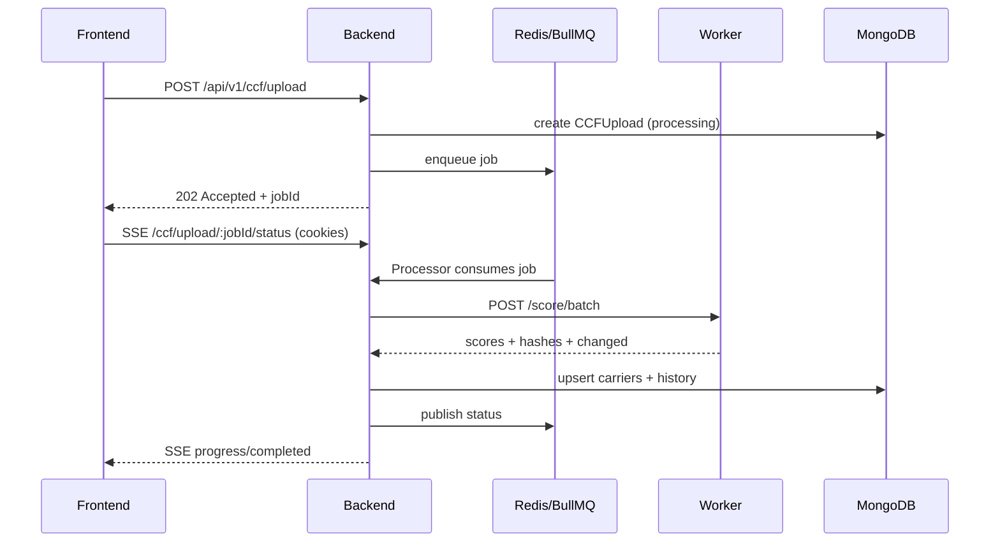

# Distributed Scoring Architecture: A Case Study on Logistics Compliance

> High-performance scoring engine for CCF ingestion, carrier risk assessment, and real-time processing — designed for scalability challenges in freight compliance platforms.

---

## Purpose & Context

**Purpose:** This repository documents a Proof of Concept (PoC) for a distributed architecture for large-scale carrier scoring processing.

**Context:** Focused on the challenges of compliance platforms in the freight industry: CCF volume, latency, resilience, and independent evolution of the risk model.

---

## Table of Contents

- [Overview](#overview)
- [What Was Implemented](#what-was-implemented)
- [Architecture](#architecture)
- [Tech Stack](#tech-stack)
- [Project Structure](#project-structure)
- [Environment](#environment)
- [How To Run](#how-to-run)
- [API Reference](#api-reference)
- [Scoring Algorithm](#scoring-algorithm)
- [Design Decisions & Trade-offs](#design-decisions--trade-offs)
- [References](#references)
- [Quality, Testing, and CI](#quality-testing-and-ci)
- [AI Assistance Policy](#ai-assistance-policy)
- [Limitations and Next Steps](#limitations-and-next-steps)

---

## Overview

This system is built as a 3-service architecture:

- `backend` in NestJS (main API, auth, upload, queue, cache, SSE)
- `scoring-worker` in FastAPI (stateless scoring + hashing microservice)
- `frontend` in Next.js (dashboard, auth, upload, and processing visibility)

Core flow:

1. User authenticates with JWT.
2. CCF upload hits the backend (`/api/v1/ccf/upload`).
3. Backend records upload audit metadata and enqueues a BullMQ job.
4. Processor calls the Python worker in batches (`POST /score/batch`).
5. Results are persisted in MongoDB, cache is invalidated, and status is published via SSE.
6. Frontend listens to real-time status updates and refreshes carrier data.

---

## What Was Implemented

### Backend (`backend/`)

- Full JWT auth: `register`, `login`, `refresh`, `GET /auth/me`, `POST /auth/logout`.
- Auth via httpOnly cookies (access + refresh + CSRF double-submit); `X-CSRF-Token` required on mutations.
- Correlation ID middleware and enhanced logging (errors, userId, duration, content-length).
- Circuit breaker and retry with exponential backoff for backend -> scoring worker calls; BullMQ job-level retries.
- Health endpoint includes `uptime_seconds`, `version`, and `circuit_breaker` state; `GET /health/score-weights` proxies scoring weights.
- Carriers module with:
  - listing with filters (`min_score`, `max_score`, `authority_status`, `search`)
  - cursor-based pagination
  - carrier detail and history
  - Redis cache for list (TTL 60s) and detail (TTL 120s)
- CCF module with:
  - upload via `application/json` or `multipart/form-data`
  - support for payload shapes `[]`, `{ records: [] }`, and `{ carriers: [] }`
  - upload audit trail (`ccf_uploads`)
  - async processing via BullMQ
  - status SSE endpoint at `/api/v1/ccf/upload/:jobId/status`
- Backend -> worker integration with 10s timeout per batch.
- Health endpoint with MongoDB, Redis, and scoring worker status.
- Baseline hardening and observability:
  - `helmet`
  - global rate limiting with Redis-backed storage
  - standardized exception filter
  - structured logging interceptor
  - env validation with `@nestjs/config + Joi`
- Swagger at `/api/v1/docs`.

### Scoring Worker (`scoring-worker/`)

- FastAPI with routes:
  - `POST /score`
  - `POST /score/batch`
  - `GET /score/weights` (factor weights and tier thresholds)
  - `GET /health`
- Pydantic models for input/output contracts; per-factor explainability (`FactorExplanation`) in score results.
- Configurable scoring weights via env vars (`WEIGHT_SAFETY_RATING`, etc.; must sum to 100).
- Deterministic scoring algorithm (6 factors, max 100 points, SAFE/CAUTION/RISK tiers).
- Canonical SHA-256 hash service.
- Change detection using `previous_hashes`.
- Supports both rate scales:
  - `0..1` (ratio)
  - `0..100` (percentage)
- Returns `207 Multi-Status` for partial batch failures.

### Frontend (`frontend/`)

- App Router pages:
  - `/login`
  - `/` (dashboard)
  - `/carriers`
  - `/carriers/[id]`
- Auth context with protected-route redirection; session via `GET /auth/me` (cookie-based).
- API client with:
  - `credentials: 'include'` (cookies)
  - `X-CSRF-Token` header on mutations
  - automatic token refresh on `401` via cookie
  - 10s timeout
  - typed `ApiError`
- Upload flow with client-side validation:
  - `.json` file type
  - 10MB max size
  - support for array/`records`/`carriers` payloads
- Real-time tracking via SSE.
- Dashboard with stats, filters, table, cards, and detail view with breakdown + timeline + per-factor explanations when available.
- Optional mock API mode for local development (`NEXT_PUBLIC_MOCK_API=true`).

### Final integration

- `docker-compose.yml` includes health checks for `mongodb`, `redis`, `scoring-worker`, `backend`, and `frontend`.
- CI in `.github/workflows/ci.yml` with separate backend/worker/frontend jobs, compose validation, and Playwright E2E suite (auth, upload, carriers).

---

## Architecture

```mermaid
graph TB
  subgraph frontend_app [Frontend - Next.js/TypeScript]
    Pages[Pages / Components]
    Services[API Services]
    SSEClient[SSE Client]
  end

  subgraph backend_app [Backend - NestJS/TypeScript]
    Controllers[REST Controllers]
    Auth[JWT Auth]
    UseCases[Services / Use Cases]
    QueueProducer[BullMQ Producer]
    QueueProcessor[BullMQ Processor]
    Repos[Mongoose Repositories]
    Cache[Redis Cache]
    SSEEndpoint[SSE Endpoint]
  end

  subgraph worker_app [Scoring Worker - Python/FastAPI]
    ScoreRoutes[/score + /score/batch]
    ScoringService[ScoringService]
    HashService[HashService]
  end

  subgraph infra [Infra]
    Mongo[(MongoDB)]
    Redis[(Redis)]
  end

  Pages --> Services
  SSEClient --> SSEEndpoint
  Services --> Controllers
  Controllers --> Auth
  Controllers --> UseCases
  UseCases --> QueueProducer
  QueueProducer --> Redis
  Redis --> QueueProcessor
  QueueProcessor -->|HTTP| ScoreRoutes
  ScoreRoutes --> ScoringService
  ScoreRoutes --> HashService
  QueueProcessor --> Repos
  Repos --> Mongo
  Cache --> Redis
  SSEEndpoint --> Redis
```

### Asynchronous upload flow



---

## Tech Stack

### Backend

- Node.js 22+
- TypeScript
- NestJS
- Mongoose / MongoDB
- BullMQ (`@nestjs/bullmq`)
- Redis (`ioredis`)
- Auth: `@nestjs/jwt`, `passport-jwt`, `bcryptjs`
- Validation: `class-validator`, `class-transformer`, Joi
- Security: `helmet`, `@nestjs/throttler`
- Docs: `@nestjs/swagger`
- Tests: Jest + `mongodb-memory-server`

### Scoring Worker

- Python 3.12
- FastAPI + Uvicorn
- Pydantic v2
- Poetry
- Ruff + Black
- Pytest + HTTPX

### Frontend

- Next.js (App Router)
- React + TypeScript
- Tailwind CSS
- Vitest + Testing Library

### Infra / DevOps

- Docker + Docker Compose
- GitHub Actions CI
- Service-level health checks

---

## Project Structure

```text
carrier-assure-v3/
├── docker-compose.yml
├── README.md
├── .github/workflows/ci.yml
├── e2e/
│   ├── playwright.config.ts
│   ├── package.json
│   └── tests/
│       ├── auth.spec.ts
│       ├── upload.spec.ts
│       └── carriers.spec.ts
├── sample-data/
│   ├── payload.json
│   └── payload-modified.json
├── shared-contracts/
│   └── api-contracts.ts
├── backend/
│   ├── src/
│   │   ├── auth/
│   │   ├── carriers/
│   │   ├── ccf/
│   │   ├── shared/
│   │   ├── health/
│   │   ├── app.module.ts
│   │   └── main.ts
│   └── test/
├── scoring-worker/
│   ├── src/
│   │   ├── routes/
│   │   ├── scoring/
│   │   ├── hashing/
│   │   └── main.py
│   └── tests/
└── frontend/
    ├── src/
    │   ├── app/
    │   ├── components/
    │   ├── services/
    │   ├── hooks/
    │   ├── lib/
    │   └── types/
    └── __tests__/
```

---

## Environment

Copy the example below to `.env` at the project root (or per service) and adjust for your environment. Never commit real secrets.

**Root / Backend (NestJS)** — required for local runs without Docker:

```env
# Backend
NODE_ENV=development
PORT=3000
MONGODB_URI=mongodb://localhost:27017/carrier-assure
REDIS_URL=redis://localhost:6379
SCORING_SERVICE_URL=http://localhost:8001
JWT_SECRET=your-jwt-secret-min-8-chars
JWT_REFRESH_SECRET=your-refresh-secret-min-8-chars
FRONTEND_URL=http://localhost:3001
```

**Scoring Worker (FastAPI)** — optional; defaults are shown. Weights must sum to 100:

```env
PORT=8001
WEIGHT_SAFETY_RATING=25
WEIGHT_OOS_PCT=20
WEIGHT_CRASH_TOTAL=20
WEIGHT_DRIVER_OOS=15
WEIGHT_INSURANCE=10
WEIGHT_AUTHORITY=10
```

**Frontend (Next.js)** — optional; used when not using Docker:

```env
NEXT_PUBLIC_API_URL=http://localhost:3000/api/v1
# NEXT_PUBLIC_MOCK_API=true
```

With `docker compose`, most of these are set in `docker-compose.yml`; override with a `.env` file next to it if needed.

---

## How To Run

### Prerequisites

- Docker Desktop running
- Free ports: `3000`, `3001`, `6379`, `8001`, `27017`

### Start the full environment

From the project root:

```bash
docker compose up --build -d
```

### Check service status

```bash
docker compose ps
```

### Useful endpoints

- Frontend: [http://localhost:3001](http://localhost:3001)
- Login: [http://localhost:3001/login](http://localhost:3001/login)
- Backend base: [http://localhost:3000/api/v1](http://localhost:3000/api/v1)
- Swagger: [http://localhost:3000/api/v1/docs](http://localhost:3000/api/v1/docs)
- Health backend: [http://localhost:3000/api/v1/health](http://localhost:3000/api/v1/health)
- Health scoring worker: [http://localhost:8001/health](http://localhost:8001/health)

### Quick frontend flow

1. Open `http://localhost:3001/login`
2. Create an account or sign in
3. Upload `sample-data/payload.json` in the upload card
4. Track SSE progress and final summary
5. Review carrier ranking and detail views

### Stop the environment

```bash
docker compose down
```

---

## API Reference

### Backend (`/api/v1`)

| Method | Endpoint | Auth | Description |
|---|---|---|---|
| `POST` | `/auth/register` | No | User registration (sets cookies) |
| `POST` | `/auth/login` | No | Login (sets cookies) |
| `POST` | `/auth/refresh` | No | New access token (cookie or body) |
| `GET` | `/auth/me` | Yes | Current user (session check) |
| `POST` | `/auth/logout` | No | Clear auth cookies |
| `GET` | `/health/score-weights` | No | Scoring weights and tier thresholds (proxy) |
| `POST` | `/ccf/upload` | Yes | CCF upload and job enqueue |
| `GET` | `/ccf/upload/:jobId/status` (SSE) | Yes | Real-time processing status |
| `GET` | `/ccf/uploads` | Yes | Upload history |
| `GET` | `/carriers` | Yes | Filtered list with cursor pagination |
| `GET` | `/carriers/:id` | Yes | Carrier detail |
| `GET` | `/carriers/:id/history` | Yes | Carrier score history |
| `GET` | `/health` | No | Dependency health check |

### Scoring worker (internal)

| Method | Endpoint | Description |
|---|---|---|
| `POST` | `/score` | Single record scoring |
| `POST` | `/score/batch` | Batch scoring with `previous_hashes` |
| `GET` | `/score/weights` | Factor weights and tier thresholds |
| `GET` | `/health` | Worker health endpoint |

---

## Scoring Algorithm

A 6-factor model totaling 100 points. The composite score is:

$$\text{Score} = \sum_{i=1}^{n} (\text{Factor}_i \times \text{Weight}_i) - \text{Penalties}$$

(Each factor contributes up to its max points; weights are configurable and must sum to 100.)

| Factor | Max points | Rule summary |
|---|---:|---|
| `safety_rating` | 25 | Satisfactory is best, Unsatisfactory is worst, neutral when missing |
| `oos_rate` | 20 | Lower is better |
| `crash_total` | 20 | Fewer crashes means higher score |
| `driver_oos_rate` | 15 | Lower is better |
| `insurance_status` | 10 | Active gets max points |
| `authority_status` | 10 | Active > Inactive > Revoked |

Tiers:

- `SAFE` for score `>= 70`
- `CAUTION` for score `>= 40` and `< 70`
- `RISK` for score `< 40`

### Hash-based change detection

- Hash per carrier (not per full file)
- Canonical JSON + SHA-256
- String normalization (`strip + lower`)
- Fixed relevant fields for hashing
- `previous_hashes` in batch requests for real change detection

Result: partial re-uploads only reprocess changed records.

---

## Design Decisions & Trade-offs

### 1) Backend Node + worker Python

- **Decision:** Separate orchestration (NestJS) from scoring computation (FastAPI).
- **Benefit:** Clear responsibility boundaries and independent scoring evolution.
- **Trade-off:** Introduces an internal HTTP contract and one more operational failure point.

This stack was chosen with freight compliance platforms in mind:

- **Batch processing:** Large CCF volumes require asynchronous queues so the API stays responsive and workloads can scale.
- **Scoring evolution:** The scoring logic can evolve (e.g. ML/LLM integration) in the Python worker without touching the main backend.
- **Data handling:** Sensitive carrier data is processed in an isolated worker, making it easier to apply security and audit policies.

### 2) Asynchronous upload with BullMQ + SSE

- **Decision:** Use queue-based upload jobs and SSE feedback.
- **Benefit:** API returns quickly with `202`, frontend gets progress without polling.
- **Trade-off:** Higher complexity than synchronous flow and Redis dependency in the path.

### 3) Redis as a multi-purpose layer

- **Decision:** Use Redis for queue, cache, and status pub/sub.
- **Benefit:** Lean stack with strong read/event performance.
- **Trade-off:** Centralizes multiple responsibilities in one infrastructure service.

### 4) Cursor pagination + query caching

- **Decision:** Backend cursor pagination with filter-hash cache keys.
- **Benefit:** Good performance for frequent list/filter access.
- **Trade-off:** Cache invalidation must be carefully handled after processing.

### 5) httpOnly cookies + CSRF

- **Decision:** Tokens in httpOnly cookies with double-submit CSRF token for mutations.
- **Benefit:** Tokens not readable by JS; reduced XSS impact; CSRF protection on state-changing requests.
- **Trade-off:** Frontend must send `credentials: 'include'` and read CSRF cookie for `X-CSRF-Token` header.

### 6) SSE auth via cookies

- **Decision:** SSE endpoint accepts auth via cookie (same origin or CORS with credentials).
- **Benefit:** No token in URL; `EventSource` with `withCredentials: true` sends cookies.
- **Trade-off:** Requires same-site or correctly configured CORS for cross-origin frontends.

### 7) Circuit breaker and retries for scoring

- **Decision:** Circuit breaker (CLOSED/OPEN/HALF_OPEN) around scoring calls; exponential backoff retries (3 attempts); BullMQ job-level retries.
- **Benefit:** Resilience to transient worker failures; health endpoint exposes circuit state.
- **Trade-off:** More moving parts; OPEN state fails fast until reset timeout.

### 8) Configurable scoring weights

- **Decision:** Scoring worker reads factor weights from env (`WEIGHT_SAFETY_RATING`, etc.); startup validation that they sum to 100.
- **Benefit:** Calibration without code changes; `GET /score/weights` and backend proxy for inspection.
- **Trade-off:** Misconfiguration can change score distribution.

### 9) Worker supports both `0..1` and `0..100`

- **Decision:** Normalize rates to support multiple payload formats.
- **Benefit:** Better robustness and compatibility with real/example datasets.
- **Trade-off:** Increases validation surface and requires regression coverage.

---

## References

Sources consulted in the elaboration of this Case Study:

**Carrier Assure (official):**

- [Carrier Assure](https://www.carrierassure.com/)
- [How it works](https://www.carrierassure.com/how-it-works)
- [About us](https://www.carrierassure.com/about-us)
- [Report a broker](https://www.carrierassure.com/report-a-broker)
- [Reports](https://www.carrierassure.com/reports)
- [Case studies](https://www.carrierassure.com/case-studies)

**Community and channels:**

- [Reddit — Carrier Assure implements broker scoring](https://www.reddit.com/r/FreightBrokers/comments/1eijwrt/carrier_assure_implements_broker_scoring_declares/)
- [Facebook — Carrier Assure](https://www.facebook.com/CarrierAssure/)
- [YouTube — Carrier Assure](https://www.youtube.com/@carrierassure/videos)

---

## Quality, Testing, and CI

### Implemented tests

- Backend:
  - unit: auth, repository, processor, cache
  - integration: upload -> processing -> persistence -> SSE flow
- Scoring worker:
  - scoring rules and boundaries
  - deterministic hashing
  - `/score`, `/score/batch`, `/score/weights`, `/health` routes
- Frontend:
  - components (`Badge`, `CarrierCard`, `CarrierFilters`, `ScoreRing`, `UploadZone`)
  - hooks (`useDebounce`, `useToast`)
  - services (`auth.service`, `carriers.service`)
- E2E (Playwright, `e2e/`):
  - auth: register -> login -> verify session -> logout
  - upload: login -> upload sample payload -> wait for completion
  - carriers: navigate list -> open detail -> verify breakdown

### Useful commands

Backend:

```bash
cd backend
npm run lint
npm run test
npm run build
```

Scoring worker:

```bash
cd scoring-worker
poetry run ruff check .
poetry run pytest tests/ -v
```

Frontend:

```bash
cd frontend
npm run lint
npm run test
npm run build
```

E2E (requires stack running on ports 3000, 3001):

```bash
cd e2e
npm install
npx playwright install --with-deps chromium
npm run test
```

### CI

Pipeline in `.github/workflows/ci.yml`:

- `lint-and-test-backend`
- `lint-and-test-worker`
- `lint-and-test-frontend`
- `docker-compose-check`
- `e2e` (after compose; starts stack, runs Playwright, then teardown)

---

## AI Assistance Policy

This project was developed with AI assistance, with mandatory human review at every stage.

Policy used in this repository:

- AI was used to accelerate scaffolding, modular implementation, and baseline test creation.
- Every generated suggestion was manually reviewed, adjusted, and validated before merging.
- Architecture decisions, API contract ownership, and final trade-offs remained human-led.
- No production secrets were included in prompts.
- Technical validation was mandatory after generation:
  - build
  - lint
  - tests
  - integration checks

In short, AI was used as a productivity multiplier and review assistant, not as a replacement for technical ownership.

---

## Limitations and Next Steps

- Consider OpenTelemetry or APM for distributed tracing across backend and worker.
- Optional: expose readiness vs liveness separately for k8s-style orchestration.
- Score thresholds (SAFE/CAUTION band boundaries) could be made configurable alongside weights.
- Further E2E coverage (e.g. filters, pagination, error paths) as needed.

**AI readiness:** The scoring-worker architecture is designed to support future LLM integration for risk narrative generation. The `FactorExplanation` model and current endpoints already provide per-factor descriptions; an LLM layer could generate natural-language risk summaries from the score breakdown without changing the core API shape.
